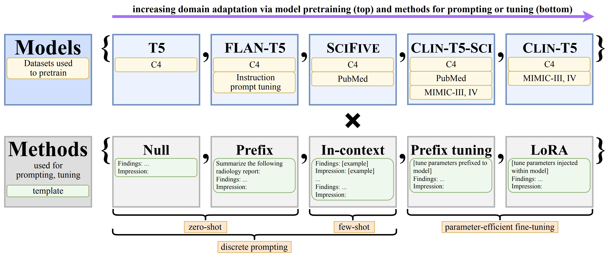

# RadAdapt | ACL BioNLP 2023 (oral)

Official implementation of RadAdapt from Stanford University.<br>
- <b> Title: </b>[RadAdapt: Radiology Report Summarization via Lightweight
Domain Adaptation of Large Language Models](https://arxiv.org/pdf/2305.01146.pdf)<br>
- <b>Authors: </b>[Dave Van Veen\*](https://davevanveen.com/), [Cara Van Uden\*](https://caravanuden.com/), Maayane Attias, Anuj Pareek, Christian Bluethgen, Malgorzata Polacin, Wah Chiu, Jean-Benoit Delbrouck, Juan Manuel Zambrano Chaves, Curtis P. Langlotz, Akshay S. Chaudhari, John Pauly<br>
- <b>Contact: </b>{vanveen, cvanuden} [at] stanford [dot] edu<br>



## Environment
Use these commands to set up a conda environment:
```
conda env create -f env/environment.yml
conda activate radadapt
```

If your CUDA toolkit is older than 11.6 (display via `nvcc --version`), refer to `env/README.md` for modified instructions.

## Usage

1. In `src/constants.py`, set your own project directory `DIR_PROJECT`.
2. Run a script, setting `model` and `case_id` as desired:
    - `run_discrete.sh`: generate output via discrete prompting.
    - `train_peft.sh`: fine-tune a model using a parameter-efficient method. LoRA is recommended.
    - `run_peft.sh`: generate output from a fine-tuned model.
    - `calc_metrics.sh`: calculate metrics on outputs.
3. To modify default parameters, create a new `cases` entry in `src/constants.py`.
4. To add your own dataset, follow the format in `data/`, which contains a subset of chest x-ray reports from [Open-i](https://openi.nlm.nih.gov/faq).

## Citation
```
@article{van2023radadapt,
  title={RadAdapt: Radiology Report Summarization via Lightweight Domain Adaptation of Large Language Models},
  author={Van Veen, Dave and Van Uden, Cara and Attias, Maayane and Pareek, Anuj and Bluethgen, Christian and Polacin, Malgorzata and Chiu, Wah and Delbrouck, Jean-Benoit and Chaves, Juan Manuel Zambrano and Langlotz, Curtis P and others},
  journal={arXiv preprint arXiv:2305.01146},
  year={2023}
}
```
